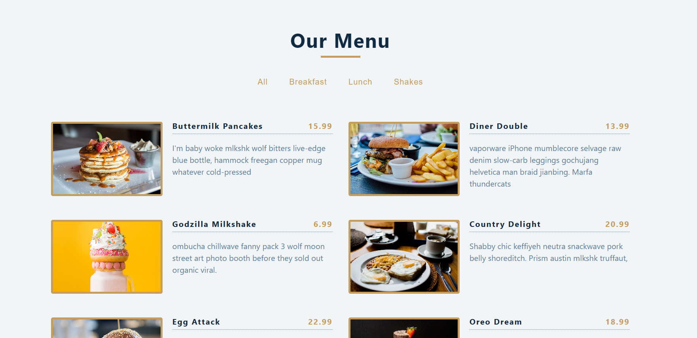

# React Projects Menu
This React project allows users to filter menu options based on categories. The application is designed to be generic,
dynamically creating buttons for new categories added to the data list.
It utilizes the Set data structure provided by ES6 to maintain an array of unique categories from the `data.js` file.

## Features
- Dynamic filtering of menu options based on categories.
- Automatic creation of buttons for new categories.
- Utilizes the Set data structure for maintaining unique categories.

## Technology
- React

## live view
https://majestic-klepon-d9f72f.netlify.app/

## design

